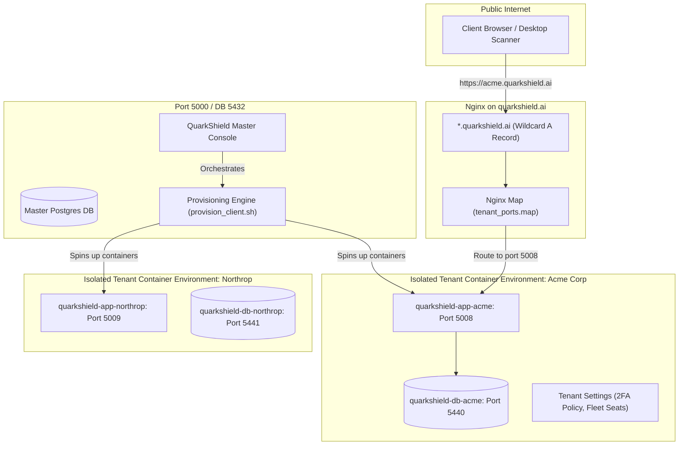
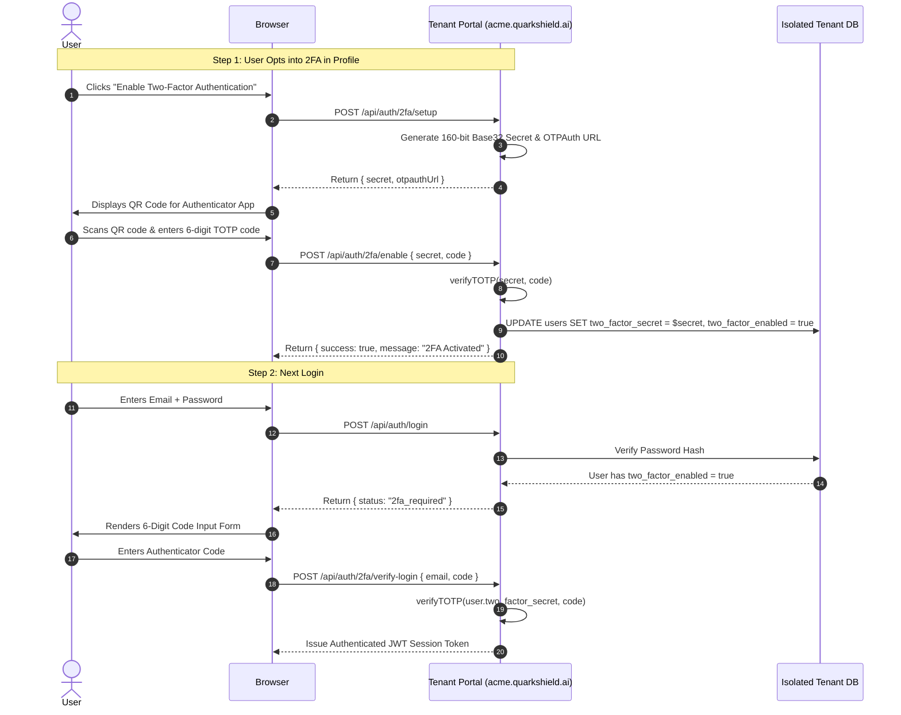

# Tenant Registration & In-Tenant User Management Architecture
## QuarkShield Multi-Tenant Isolation, Optional 2FA Policies & In-Tenant RBAC

---

## 1. Executive Summary

QuarkShield operates on a **physically isolated multi-tenant architecture**. Unlike shared-database multi-tenancy (which relies on logical `tenant_id` WHERE clauses that are vulnerable to data leakage), QuarkShield provides each tenant with:
1. **Dedicated Subdomain**: `https://<tenant>.quarkshield.ai`
2. **Isolated Application Container**: `quarkshield-app-<tenant>` (running on an assigned private port, e.g., `5001-5099`)
3. **Isolated PostgreSQL Database**: `quarkshield-db-<tenant>` (running on an assigned DB port, e.g., `5433-5599`)
4. **Isolated Fleet Token & Cryptographic Key Store**.

This document details:
- **How a tenant is registered** (self-service vs. admin-orchestrated) with configurable **2FA (Two-Factor Authentication)**.
- **How 2FA operates** (user-level optional vs. tenant-wide enforced).
- **How User Management functions within a tenant** (In-Tenant RBAC, user invitations, role delegation, 2FA resets, and account suspension).

---

## 2. Multi-Tenant Architectural Topology



---

## 3. Tenant Registration Workflow

There are two primary pathways to register a new tenant:

### Pathway A: Admin-Orchestrated Registration (Enterprise / Partner POC)
1. **Operator Action**: System Administrator navigates to **Admin Panel $\rightarrow$ Tenant Registry** or **Partner & Corporate Licenses**.
2. **Input Parameters**:
   - Organization Name: e.g., `Acme Corp` (automatically sanitized to slug `acmecorp`).
   - Primary Tenant Administrator Email: `secops.admin@acmecorp.com`.
   - Initial Password / Activation Token.
   - Assigned Subscription Tier: `partner_trial` (30 days), `corporate_enterprise` (365 days), or `growth`.
   - Seat Capacity: e.g., `250` endpoint scanner seats.
   - **2FA Policy**:
     - `Optional` (Default)
     - `Admins Only` (Enforced for Tenant Admin & SecOps roles)
     - `Mandatory` (Enforced for all enterprise users)
3. **Execution Pipeline**:
   - Master backend calls `findNextAvailablePorts()` $\rightarrow$ allocates App Port `5010` and DB Port `5442`.
   - Executes `/opt/quantum-rap/provision_client.sh acmecorp 5010 5442 ...`.
   - Generates directory `/opt/quantum-rap-clients/acmecorp/docker-compose.yml`.
   - Spawns `quarkshield-app-acmecorp` and `quarkshield-db-acmecorp`.
   - Updates `/etc/nginx/tenant_ports.map`:
     ```nginx
     acmecorp.quarkshield.ai 5010;
     ```
   - Reloads Nginx (`systemctl reload nginx`).
   - Seeds initial Tenant Admin user into `quarkshield_acmecorp.users` with assigned role `admin`.
   - Sends welcome email with dedicated portal URL (`https://acmecorp.quarkshield.ai`).

---

### Pathway B: Self-Service Enterprise / Partner Registration
1. Prospective partner or customer visits `https://quarkshield.ai` and clicks **"Register / 30-Day Evaluation"**.
2. Fills in:
   - Full Name, Work Email, Company Name, Country, Phone Number.
   - Desired Password.
3. Master platform auto-provisions tenant subdomain (`https://<company>.quarkshield.ai`) in the background.
4. Tenant admin receives verification email to activate account and initial tenant space.

---

## 4. Two-Factor Authentication (2FA) Design: Optional vs. Enforced

QuarkShield uses standard **RFC 6238 TOTP** (compatible with Google Authenticator, Microsoft Authenticator, Apple Keychain, 1Password, and hardware tokens).

### 4.1 Tenant-Level 2FA Policy Settings
Stored in each tenant's isolated database in `tenant_settings`:

| Policy Key | Allowed Values | Description |
| :--- | :--- | :--- |
| `two_factor_policy` | `optional` | **Default**: Users can choose to enable 2FA in their account profile. Not required. |
| `two_factor_policy` | `admins_only` | **High Security**: Users with role `admin` or `secops` must enable 2FA before accessing dashboard. |
| `two_factor_policy` | `enforced` | **Zero-Trust Enterprise**: All users must configure 2FA upon first login. |

```sql
-- Schema addition in tenant database
CREATE TABLE IF NOT EXISTS tenant_settings (
  key VARCHAR(100) PRIMARY KEY,
  value TEXT NOT NULL,
  updated_at TIMESTAMP DEFAULT CURRENT_TIMESTAMP
);

INSERT INTO tenant_settings (key, value) 
VALUES ('two_factor_policy', 'optional')
ON CONFLICT (key) DO NOTHING;
```

---

### 4.2 User-Level Optional 2FA Lifecycle



---

## 5. In-Tenant User Management (RBAC)

Once inside their dedicated portal (`https://<tenant>.quarkshield.ai`), the Tenant Admin has complete authority over their organizational directory.

### 5.1 In-Tenant Roles & Permissions Matrix

| Capability | Tenant Admin (`admin`) | SecOps Engineer (`secops`) | Compliance Auditor (`auditor`) | Read-Only Viewer (`viewer`) |
| :--- | :---: | :---: | :---: | :---: |
| **Manage Users & Invite Colleagues** | ✅ | ❌ | ❌ | ❌ |
| **Configure Tenant 2FA Policy** | ✅ | ❌ | ❌ | ❌ |
| **Reset User 2FA / Unlock Account** | ✅ | ❌ | ❌ | ❌ |
| **Manage Cloud Fleet / API Tokens** | ✅ | ✅ | ❌ | ❌ |
| **Trigger Outbound TLS Probes & Scans** | ✅ | ✅ | ❌ | ❌ |
| **Run Q-Migrate & Code Snippet Generator** | ✅ | ✅ | ❌ | ❌ |
| **View CBOM & Inventory Assets** | ✅ | ✅ | ✅ | ✅ |
| **Export CNSA 2.0 / NIST Compliance Reports** | ✅ | ✅ | ✅ | ✅ |

---

### 5.2 In-Tenant User Management Features in UI

A dedicated **"User Management"** tab inside the Tenant Settings includes:

1. **Invite User Form**:
   - Inputs: Colleague Email, Full Name, Role (`Tenant Admin`, `SecOps Engineer`, `Auditor`, `Viewer`).
   - Dispatches invitation email with direct link to `https://<tenant>.quarkshield.ai/invite/<token>`.
2. **Active User Directory Table**:
   - Columns:
     - **User**: Name + Email
     - **Role**: Role badge with color coding (`admin` = cyan, `secops` = purple, `auditor` = amber, `viewer` = grey).
     - **2FA Status**: Shield badge:
       - 🟢 **Enabled** (Protected with Authenticator App)
       - ⚪ **Disabled** (Password only)
       - 🟡 **Pending Enrollment** (If 2FA is enforced but user hasn't set up yet)
     - **Last Login**: Relative time (e.g. `2 hours ago`).
     - **Status**: `Active` or `Suspended`.
     - **Actions**:
       - ✏️ Change Role
       - 🔑 **Reset 2FA** (Emergency reset if employee lost their phone)
       - 🔒 **Suspend / Activate User** (Instant lock without deleting historical audit logs)
       - 🗑️ Remove User from Tenant

---

## 6. API Endpoints for In-Tenant User Management

These endpoints run on the **tenant's container** and interact strictly with the tenant's isolated PostgreSQL database:

```typescript
// 1. Get all users within this tenant
GET /api/tenant/users
Authorization: Bearer <tenant_admin_token>
Response: [
  {
    id: "usr-01",
    email: "alice@acmecorp.com",
    role: "secops",
    twoFactorEnabled: true,
    status: "active",
    lastLogin: "2026-09-09T08:15:00Z"
  }
]

// 2. Invite a new user to this tenant
POST /api/tenant/users/invite
Authorization: Bearer <tenant_admin_token>
Body: {
  email: "bob@acmecorp.com",
  role: "auditor"
}

// 3. Update user role or status
PATCH /api/tenant/users/:id
Authorization: Bearer <tenant_admin_token>
Body: {
  role: "secops",
  status: "suspended"
}

// 4. Admin Reset 2FA for a locked-out employee
POST /api/tenant/users/:id/reset-2fa
Authorization: Bearer <tenant_admin_token>
Response: {
  success: true,
  message: "2FA secret cleared. User will be prompted to re-enroll on next login."
}

// 5. Configure Tenant-Wide 2FA Enforcement Policy
PUT /api/tenant/settings/2fa-policy
Authorization: Bearer <tenant_admin_token>
Body: {
  policy: "admins_only" // "optional" | "admins_only" | "enforced"
}
```

---

## 7. Migration & Rollout Plan

1. **Database Schema Update**: Add `tenant_settings` table to tenant seed schema (`schema.sql`) with `two_factor_policy`.
2. **Tenant API Controller**: Add `tenantUserController.ts` containing the in-tenant user management and 2FA reset handlers.
3. **Frontend Component**: Add the **"Team & User Management"** subtab in the client portal settings.
4. **Deploy**: Update containers seamlessly via `update_all_tenants.sh`.
